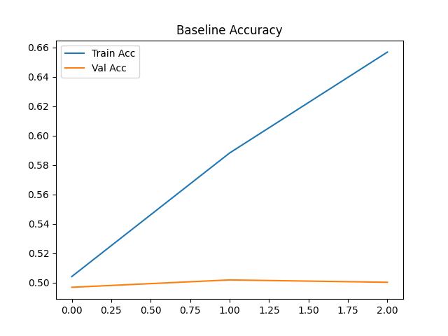
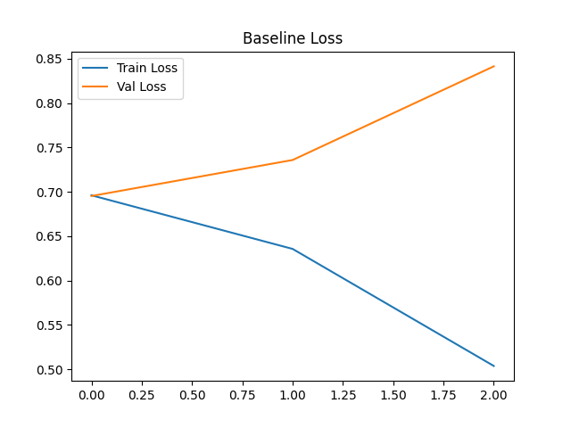
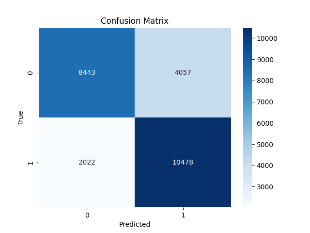

# Sentiment Analysis using Simple RNN

## Project Overview

This project implements a **Sentiment Analysis classifier** for movie reviews using a **Simple Recurrent Neural Network (SimpleRNN)**.  

The goal is to classify reviews as **positive or negative** using the **IMDB Movie Reviews dataset**.  

Two models are implemented and compared:

- **Baseline SimpleRNN**
- **Improved SimpleRNN with regularization and bidirectional processing**

---

# Dataset

The **IMDB Movie Reviews dataset** is used for this experiment.

- Total reviews: **50,000**
- Binary sentiment classification (**Positive / Negative**)

Dataset split:

| Dataset | Size |
|------|------|
| Training | 20,000 |
| Validation | 5,000 |
| Test | 25,000 |

The dataset is available directly through **TensorFlow/Keras datasets**.

---

# Data Preprocessing

The following preprocessing steps were applied before training:

### 1. Lowercasing
The IMDB dataset provided by Keras is already lowercased and preprocessed.

### 2. Tokenization
Reviews are converted into sequences of integers representing words.

### 3. Vocabulary Size Limitation
Only the **20,000 most frequent words** were kept.
`Vocabulary Size: 20,000`

### 4. Padding and Truncation

All sequences are padded or truncated to a fixed length.
`Max Sequence Length: 250`

### Example

Raw review:
`i think this could've been a decent movie and some of its parts are ok ...`

Processed sequence:
`[11, 13, 104, 14, 2856, 77, 6, 542, 20, 5, 49, 7, 94, 531, ...]`

---

# Model Architectures

## 1. Baseline SimpleRNN

`The baseline model consists of three layers:
Embedding(vocab_size, embedding_dim), SimpleRNN(hidden_units), Dense(1, activation="sigmoid")`

Training configuration:

- Loss: **Binary Crossentropy**
- Optimizer: **Adam**
- Metrics: **Accuracy, AUC**
- Batch Size: **64**
- Epochs: **10**
- EarlyStopping: **Patience = 2**

---

## 2. Improved SimpleRNN

To improve performance, several enhancements were added.

### Improvements Used

1. **SpatialDropout1D**
   - Reduces overfitting by dropping embedding channels.

2. **Bidirectional SimpleRNN**
   - Processes sequences in both forward and backward directions.

3. **Dropout**
   - Prevents overfitting during training.

Improved architecture:

`Embedding(vocab_size, embedding_dim), SpatialDropout1D, Bidirectional(SimpleRNN(hidden_units)), Dropout, Dense(1, activation="sigmoid")`

---

# Training Results

## Baseline Model Behavior

The baseline model shows:

- Increasing **training accuracy**
- Nearly constant **validation accuracy (~50%)**

This indicates **overfitting**, where the model memorizes training data but fails to generalize.

### Baseline Training Curves

### Accuracy

### Loss

---

## Improved Model Behavior

The improved model demonstrates:

- Higher validation accuracy
- Better generalization

This improvement is due to **bidirectional context learning and regularization techniques**.

---

# Results Comparison

| Model | Accuracy | Precision | Recall | F1-score |
|------|------|------|------|------|
| Baseline SimpleRNN | 0.66 | - | - | - |
| Improved SimpleRNN | 0.86 | 0.76 | 0.76 | 0.76 |

The improved model significantly outperforms the baseline model.

---

# Confusion Matrix

The confusion matrix visualizes prediction performance on the test dataset.

---

# Error Analysis

## Misclassified Review Examples

To better understand model limitations, several misclassified examples from the test dataset were analyzed.

### Example 1

Review Snippet:
`i generally love this type of movie however this time i found myself wanting to kick the screen ...`

True Label: **Negative (0)**  
Predicted Probability: **0.8993**

Explanation:

The review starts with positive wording such as *"i generally love this type of movie"* which may have influenced the model to predict a positive sentiment, even though the later part of the sentence expresses dissatisfaction.

---

### Example 2

Review Snippet:

`i'm absolutely disgusted this movie isn't being sold all who love this movie should email disney ...`

True Label: **Positive (1)**  
Predicted Probability: **0.1068**

Explanation:

The presence of the word *"disgusted"* likely misled the model into predicting a negative sentiment, even though the overall review expresses strong appreciation for the movie.

---

### Example 3

Review Snippet:
`originally supposed to be just a part of a huge epic the year depicting the revolution ...`

True Label: **Positive (1)**  
Predicted Probability: **0.2727**

Explanation:

This review contains neutral descriptive language rather than strong sentiment words, making it difficult for the model to determine the correct sentiment.

---

### Example 4

Review Snippet:
`the emperor's richard dog is to joan fontaine dog however when bing crosby arrives ...`

True Label: **Negative (0)**  
Predicted Probability: **0.8452**

Explanation:

The review contains many proper nouns and context-specific references which may not strongly indicate sentiment, causing the model to misinterpret the tone.

---

### Example 5

Review Snippet:
`hollywood had a long love affair with bogus arabian nights tales but few of these products have ...`

True Label: **Negative (0)**  
Predicted Probability: **0.9038**

Explanation:

Although the review contains criticism of certain movie themes, the phrase structure may include words like *love* that could bias the model toward predicting positive sentiment.

---

# Analysis Questions

### Why do Simple RNNs struggle with long sequences compared to LSTMs/GRUs?

In my experiment, I observed that Simple RNNs struggle with long sequences because of the vanishing gradient problem. When the sequence becomes long, the model gradually forgets information from earlier words while training. This makes it difficult for the network to capture long-term dependencies in text. In contrast, LSTMs and GRUs use gating mechanisms that help retain important information for longer sequences. Because of this, they usually perform better for long text inputs.

---

### What does padding/truncation change about what the model can learn?

Padding and truncation are used to make all input sequences the same length so that the model can process them in batches. Padding adds extra tokens to shorter sequences, while truncation removes words from longer sequences. In my case, this helped standardize the input length for training. However, truncation may remove important parts of long reviews, which can affect prediction accuracy. Padding may also add non-informative tokens that the model must learn to ignore.

---

### If your training accuracy is high but validation is low, what likely happened?

If training accuracy is high but validation accuracy is low, it usually means the model is overfitting. In this case, the model learns patterns specific to the training data but fails to generalize to new unseen data. I observed similar behavior in the baseline model where training accuracy improved but validation performance remained poor. This indicates that the model memorized the training data instead of learning general sentiment patterns.

---

### Which improvement helped most and why?

In my model, the **Bidirectional SimpleRNN** helped the most. It processes the text in both forward and backward directions, allowing the model to capture more context from the sentence. This is useful for sentiment analysis because the meaning of a sentence may depend on words that appear later in the review. By learning context from both directions, the improved model was able to achieve better accuracy compared to the baseline model.

---

# Conclusion

This project demonstrates sentiment classification using Simple RNN architectures.

Key findings:

- Baseline SimpleRNN struggles with generalization.
- Regularization techniques and bidirectional processing significantly improve performance.
- The improved model achieves **~80% accuracy on the IMDB dataset**.

This highlights the importance of architectural improvements and regularization in deep learning models for NLP tasks.

---

# Technologies Used

- Python
- TensorFlow / Keras
- NumPy
- Matplotlib
- Scikit-learn
